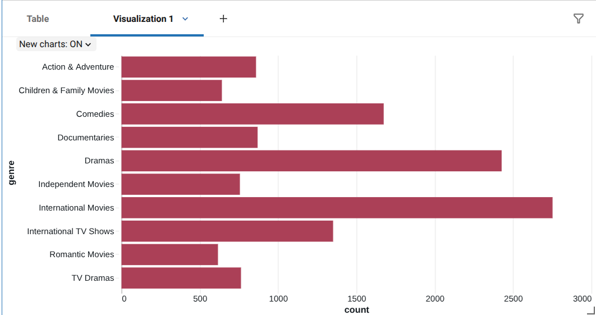
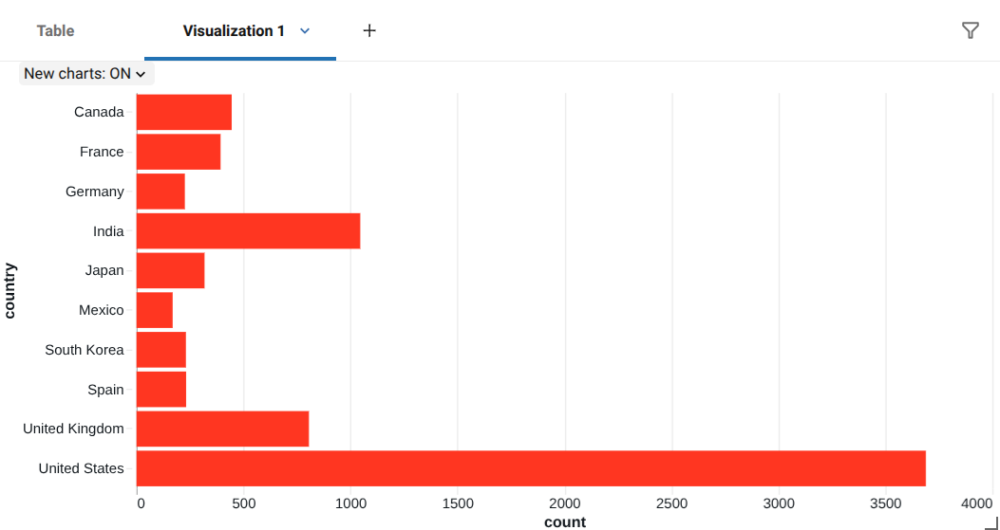
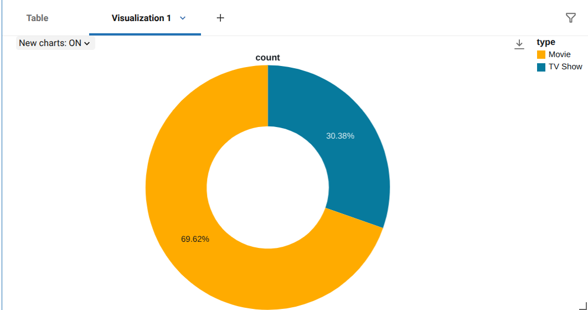

# Netflix ETL Pipeline with Databricks & PySpark

This project implements an end-to-end ETL pipeline using Databricks and PySpark following the Medallion Architecture (Bronze, Silver, Gold).

The pipeline ingests the Netflix Titles dataset, cleans and transforms the data, stores it as Delta tables, and produces analytical datasets to answer business questions (top genres? most productive countries?)

## Architecture of the ETL pipeline
Netflix CSV
      │
      ▼
Bronze Layer
(raw ingestion)
      │
      ▼
Silver Layer
(cleaning & standardization)
      │
      ▼
Gold Layer
(analytics)

## Technologies

- Databricks Free Edition
- Apache Spark (PySpark)
- Delta Tables
- Unity Catalog
- Python

## Dataset

Netflix Titles Dataset from Kaggle.

The dataset contains information about Netflix movies and TV shows including:

- title
- type
- country
- genres
- release year
- date added
- duration

## Bronze Layer

The raw CSV dataset is uploaded into a Unity Catalog Volume and ingested into Databricks. Main tasks:

- read CSV
- correctly parse multiline records
- infer schema
- store raw data as a Delta table

## Silver Layer

The Silver layer prepares the data for analysis. Transformations include:

- removing duplicate records
- renaming `listed_in` to `genre`
- trimming whitespace
- converting `date_added` from string to date
- casting `release_year` to integer
- replacing embedded newline characters
- standardizing missing values

## Gold Layer

The Gold layer creates analytical tables answering questions such as:

- Movies vs TV Shows
- Top 10 genres
- Top production countries
- Content added over time
- Longest movies

## Example Results

## Challenges

During development I encountered several challenges:

- CSV records containing embedded newline characters
- Correctly parsing multiline CSV files with Spark
- Converting string dates into Spark DateType
- Handling missing values
- Splitting multi-value genre and country columns for accurate aggregation

